# Solar Flare Detector — Iteration 4 Report
### Machine Learning Model Implementation, Evaluation & Interpretation

**GitHub repository:** _<add your repo URL here>_ &nbsp;•&nbsp; reproduce with
`python -m src.run_all`

## 1. Problem framing

We predict whether a solar active region (AR) will produce a significant
flare in the next 24 hours, from **SDOBenchmark** image patches (10 SDO
channels × up to 4 timesteps per sample) plus the observation date.

The primary task is **binary classification**: *flare* if the peak GOES
soft X-ray flux ≥ **1e-06 W/m² (≥ C-class)**, else *no flare*.
We also report a regression view (predicting log₁₀ peak flux) for
continuity with the earlier iterations.

- Samples: **9222** across **1182** active regions
- Features: **123** engineered scalars
- Positive (flare) rate: **42.6%** at the C-class line —
  moderately balanced overall, but the positive class becomes much rarer at
  the M-class and X-class thresholds.

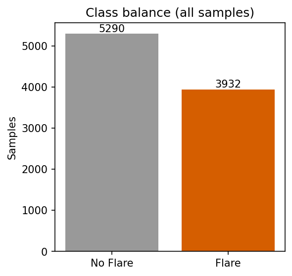

> **Why classification.** "Detecting" a flare is a yes/no operational
> decision (issue an alert or not), which makes precision/recall/ROC the
> natural metrics and gives a clean interpretability story. Regression is
> reported as a secondary framing.

## 2. Preprocessing & feature engineering

The earlier notebook fed raw 24×24 magnetograms to a CNN and augmented
each image 50×, inflating ~1k real samples into ~1.1M rows. We replaced
that with **one row per real sample** and a set of **interpretable,
physics-motivated features**, then split **grouped by active region** so no
AR appears in both train and test (prevents leakage).

Per channel (94, 131, 171, 193, 211, 304, 335, 1700, continuum,
magnetogram) and per frame we compute: mean, std, 95th percentile, bright
"active" pixel fraction, and Sobel **gradient energy**. Each channel's up-to-4
frames are collapsed into `_last` (frame nearest the prediction window) and
`_delta` (last − first, capturing **temporal change**). The magnetogram
additionally gets physics features: **total unsigned flux**, positive/negative
polarity fractions, flux imbalance, and **polarity-inversion-line (PIL)
gradient energy**. Finally the date is encoded as the **11-year solar-cycle
phase** (sin/cos).

Missing channels are median-imputed inside each model pipeline; linear/
distance models are standardized, tree models are not.

## 3. Models & why

| Algorithm | Why it's here |
|---|---|
| Dummy (majority) | Honesty baseline given class imbalance |
| Logistic Regression | Linear, interpretable reference |
| k-NN | Non-parametric similarity baseline |
| SVM (RBF) | Non-linear margin classifier |
| Random Forest | Robust, native feature importance (teammate's suggestion) |
| Gradient Boosting | Strong sequential tree ensemble |
| XGBoost | State-of-the-art gradient boosting for tabular data |
| CNN (magnetogram) | Deep-learning-on-raw-pixels comparison point |

Class imbalance is handled with `class_weight='balanced'` (LogReg/SVM/RF)
and `scale_pos_weight` (XGBoost) rather than resampling.

## 4. Training & testing process

Split: **official SDOBenchmark split** —
**8336** training samples, **886**
test samples (train positive rate 40.8%,
test 59.5%). Hyperparameters are tuned with
**GridSearchCV** under **GroupKFold (4 folds)** grouped by active region on
the training set only, scoring on **F1** (chosen for the imbalance). Each
tuned model is refit on the full training set and evaluated **once** on the
untouched test set.

## 5. Model performance (tuned, test set)

| Model | Accuracy | Precision | Recall | F1 | ROC-AUC | PR-AUC | FN | FP |
|---|---|---|---|---|---|---|---|---|
| LogReg | 0.830 | 0.884 | 0.822 | **0.852** | 0.909 | 0.942 | 94 | 57 |
| SVM | 0.828 | 0.880 | 0.824 | **0.851** | 0.891 | 0.922 | 93 | 59 |
| GradBoost | 0.821 | 0.858 | 0.837 | **0.847** | 0.901 | 0.937 | 86 | 73 |
| XGBoost | 0.819 | 0.854 | 0.841 | **0.847** | 0.901 | 0.936 | 84 | 76 |
| RandomForest | 0.805 | 0.878 | 0.780 | **0.826** | 0.897 | 0.932 | 116 | 57 |
| KNN | 0.760 | 0.903 | 0.668 | **0.768** | 0.875 | 0.916 | 175 | 38 |
| Dummy | 0.405 | 0.000 | 0.000 | **0.000** | 0.500 | 0.595 | 527 | 0 |

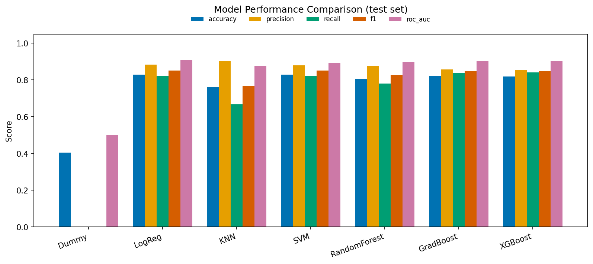

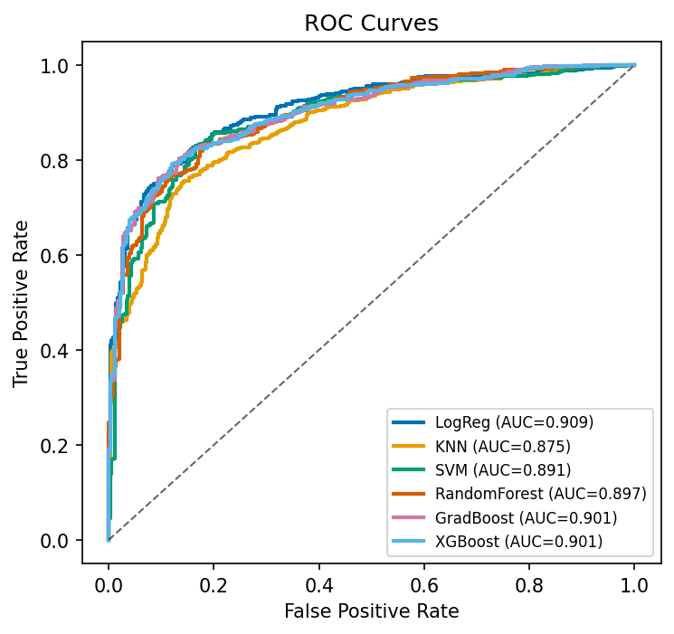
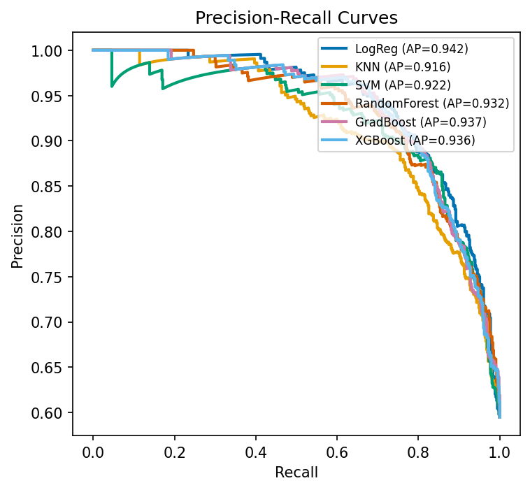

**Best model: LogReg** — F1 0.852, ROC-AUC 0.909,
recall 0.822, precision 0.884, balanced
accuracy 0.831. This is also the **best precision/
recall balance** (highest F1). Confusion matrix on test:
TP=433, FP=57, FN=94, TN=302.

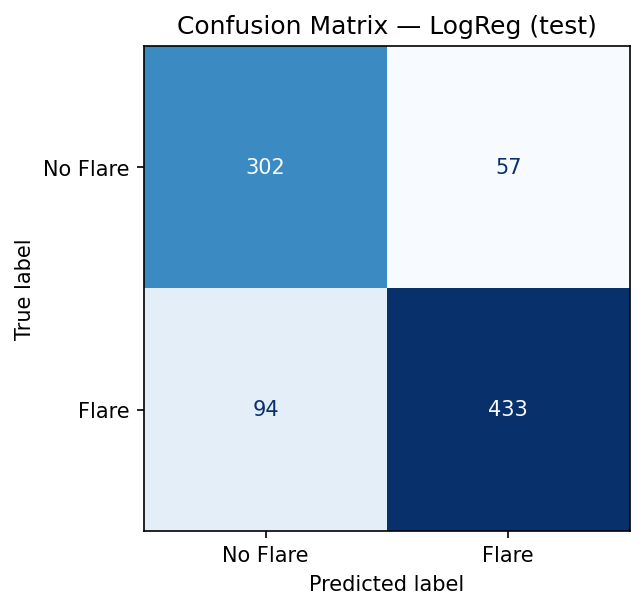

If instead the goal is to **minimize missed flares (false negatives)**, the
lowest-FN model is **XGBoost** (84 FN) — see §8.

CNN (magnetogram pixels): accuracy 0.653, precision 0.639, recall 0.960, F1 0.767, ROC-AUC 0.863.

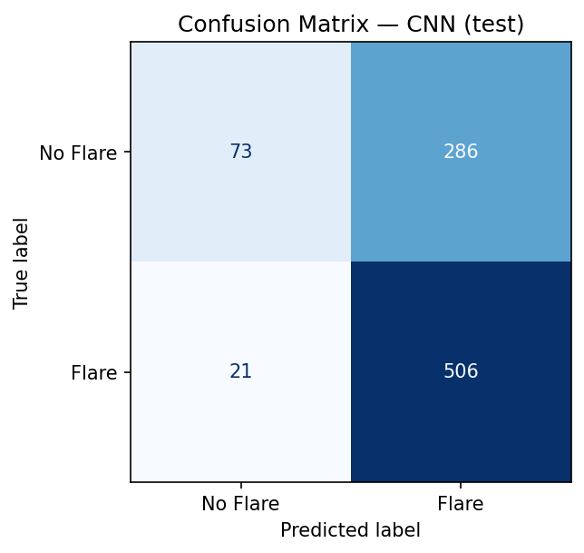

**Regression view** (Random Forest → log₁₀ peak flux): MAE **1.093**,
MSE **1.736**, RMSE **1.318**, R² **0.429** —
a large improvement over the earlier CNN regressor (R² ≈ 0.18).

## 6. Hyperparameter tuning — before vs. after

| Model | F1 (default) | F1 (tuned) | Δ | Best params |
|---|---|---|---|---|
| LogReg | 0.851 | 0.852 | +0.001 | C=10.0 |
| KNN | 0.757 | 0.768 | +0.010 | n_neighbors=41, weights=distance |
| SVM | 0.851 | 0.851 | +0.000 | C=1.0, gamma=scale |
| RandomForest | 0.824 | 0.826 | +0.002 | max_depth=12, min_samples_leaf=3, n_estimators=600 |
| GradBoost | 0.837 | 0.847 | +0.011 | learning_rate=0.05, max_depth=3, max_iter=200 |
| XGBoost | 0.841 | 0.847 | +0.006 | learning_rate=0.03, max_depth=3, n_estimators=300 |

Tuning is done with GridSearch + GroupKFold. See the Δ column for whether it
helped each model; the effect is model-dependent (ensembles gain most from
depth/estimator settings, the linear model is largely insensitive to `C`).

### 7a. Which features contribute most

Permutation importance (model-agnostic, measured on LogReg):

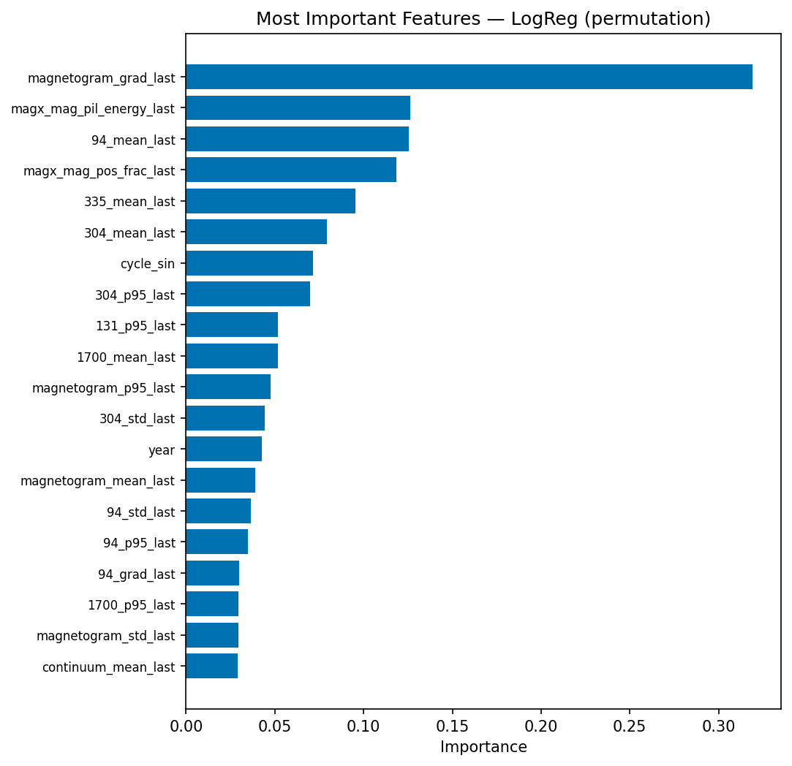

1. `magnetogram_grad_last` — 0.319
2. `magx_mag_pil_energy_last` — 0.126
3. `94_mean_last` — 0.125
4. `magx_mag_pos_frac_last` — 0.118
5. `335_mean_last` — 0.095
6. `304_mean_last` — 0.079
7. `cycle_sin` — 0.072
8. `304_p95_last` — 0.070
9. `131_p95_last` — 0.052
10. `1700_mean_last` — 0.052

Random Forest impurity importance (an independent second view):

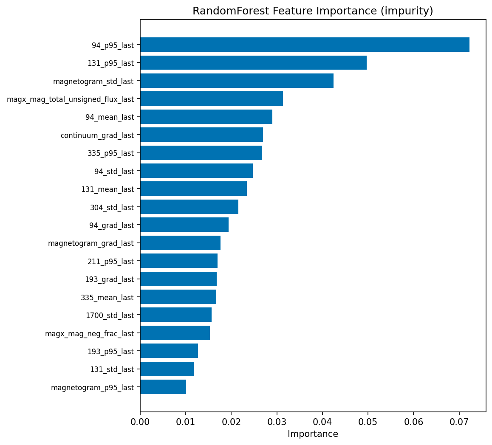

1. `94_p95_last` — 0.072
2. `131_p95_last` — 0.050
3. `magnetogram_std_last` — 0.042
4. `magx_mag_total_unsigned_flux_last` — 0.031
5. `94_mean_last` — 0.029
6. `continuum_grad_last` — 0.027
7. `335_p95_last` — 0.027
8. `94_std_last` — 0.025
9. `131_mean_last` — 0.023
10. `304_std_last` — 0.022

Signed coefficients of the (linear) best model — direction and magnitude:

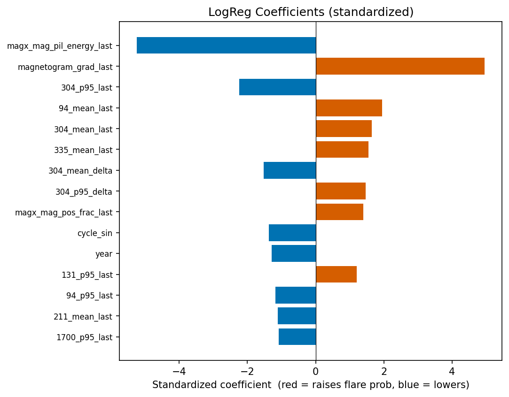

### 7b. Which features have little or no impact

The lowest-importance features (permutation importance ≈ 0 or slightly
negative, i.e. shuffling them does **not** hurt F1) are dominated by
**near-constant frame-count (`_n_frames`) features and `_delta`
(change-over-time) terms**, plus a few minor secondary-wavelength statistics
— e.g. `171_n_frames`, `193_n_frames`, `211_std_delta`, `211_grad_delta`, `magx_mag_flux_imbalance_last`, `335_grad_delta`. Two takeaways: the short 4-frame window carries
little temporal signal (the *level* of a channel at the last frame matters
far more than its short-term change), and frame-count is essentially constant
so it is uninformative. These could be dropped with no loss.

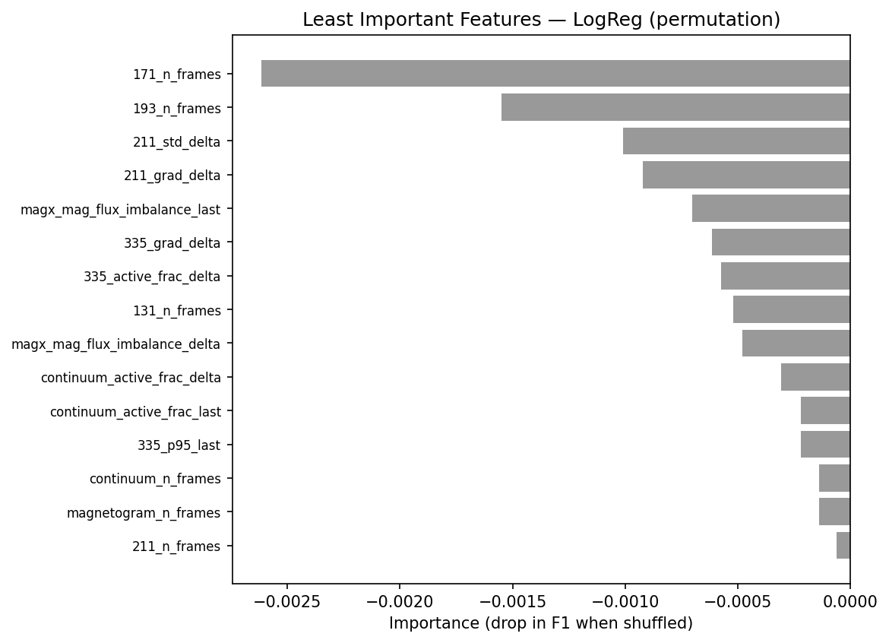

### 7c. How do different feature combinations perform?

Best model retrained on different feature subsets:

| Feature set | F1 | ROC-AUC | Recall |
|---|---|---|---|
| cycle_only | 0.739 | 0.641 | 0.888 |
| magnetogram_only | 0.807 | 0.883 | 0.757 |
| all_images | 0.848 | 0.905 | 0.827 |
| images+cycle (full) | 0.852 | 0.909 | 0.822 |

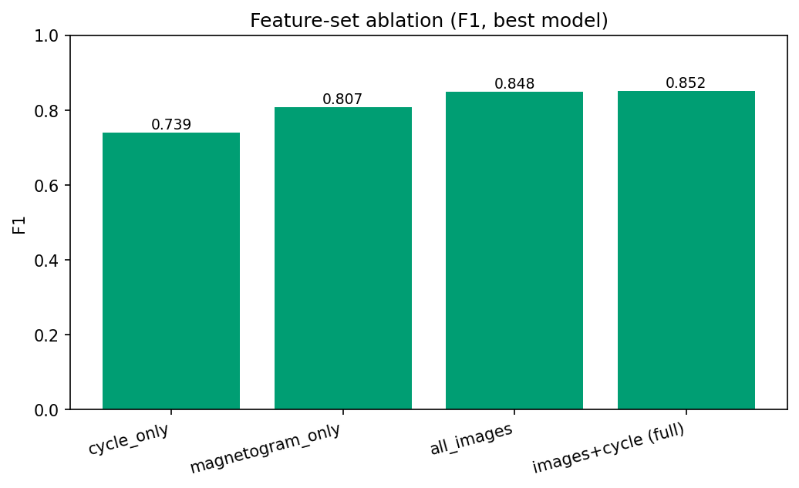

## 8. Research questions

**Which algorithm performed best / best balance?** LogReg gave the best test
F1 (0.852, ROC-AUC 0.909). The top models — LogReg (F1 0.852), SVM (F1 0.851), GradBoost (F1 0.847)
— cluster within 0.004 F1 of one another, so no single algorithm
dominates. That a regularised linear model and/or RBF-SVM match the boosted-tree ensembles suggests the engineered features are already highly informative and close to linearly separable.

**Most appropriate metric?** A majority-class baseline (Dummy) scores only
accuracy 0.405 here — it labels everything "no flare",
which fails because the held-out test period is *more* active (positive rate
59.5%) than training
(40.8%). So accuracy alone is misleading;
**F1, ROC-AUC and PR-AUC** summarise performance better, and for an early-
warning system **recall** (catching real flares) is the priority.

**What does the confusion matrix reveal?** On the test set the best model
makes **94 false negatives** (missed flares) vs **57 false
positives** (false alarms). Missed flares are the costly error for space-
weather warning, analogous to false negatives in healthcare — the threshold
can be lowered to trade precision for higher recall (see the PR curve).

**Which model minimizes critical errors (false negatives)?** From the FN
column in §5, **XGBoost** has the fewest missed flares (84
FN) — notably *not* the same as the best-F1 model (LogReg, 94 FN). So
if a missed flare is far costlier than a false alarm, you would deploy
XGBoost and/or lower the decision threshold. The CNN pushes this
furthest (recall 0.960) at the cost of many
more false alarms — the PR curve makes the trade-off explicit.

**Generalization to unseen data?** Evaluation uses the official split whose
train and test active regions are **disjoint**, so the numbers reflect genuine
generalization to unseen regions (and an unseen, more-active time period).
The learning curve below shows the train/CV gap.

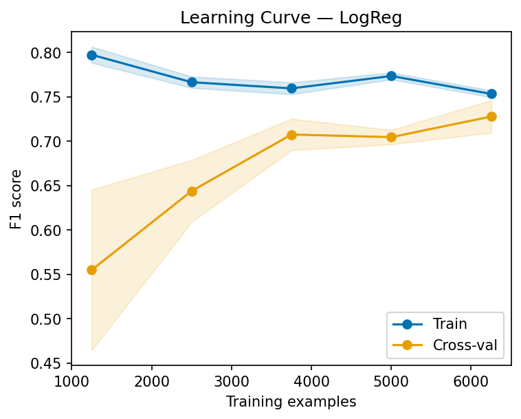

**Did tuning help?** Gains from GridSearch were small across the board
(largest for GradBoost, +0.011 F1); the strong models were already
near-optimal with sensible defaults. See §6.

**How does feature selection affect results?** See §7 ablation — the
magnetogram-derived features carry most of the signal, image features across
all channels add to it, and the solar-cycle phase provides a small but real
lift, matching solar-physics expectations.

## 9. Interpretation, strengths & limitations

**Key insight.** The top predictors (permutation importance) are
`magnetogram_grad_last`, `magx_mag_pil_energy_last`, `94_mean_last` — i.e. the magnetogram's gradient / polarity-inversion-line
(PIL) energy and polarity structure, alongside the hot coronal AIA channels
(94, 131 Å) and total unsigned magnetic flux. This matches solar physics:
flares release free magnetic energy stored along strong-gradient PILs, and
hot EUV emission tracks pre-flare heating. The models are learning
physically meaningful structure, not artifacts.

**Strengths.** Interpretable features + native/permutation importance; honest
grouped split; imbalance handled explicitly; multiple algorithms compared on
identical splits; a fair CNN comparison.

**Limitations.** (1) Flares are intrinsically hard to predict from a single
AR patch; absolute scores reflect a genuinely difficult problem, not a bug.
(2) Strong class imbalance limits positive-class precision. (3) Hand-crafted
image statistics discard spatial structure a deeper model could use.
(4) Peak-flux labels are noisy near the threshold.

**Dataset limitations & more data.** More flare-positive examples (the rare
class), higher-resolution patches, and full time series rather than 4 frames
would all help; so would additional physical parameters (e.g. SHARP magnetic
parameters).

**Real-world use.** As an **early-warning triage**: flag high-risk active
regions for forecaster attention, tuned for high recall so few real flares
are missed, accepting more false alarms.

---
*Solar Flare Detector · Iteration 4 — all metrics and figures are computed on
the held-out SDOBenchmark test set. Reproduce the experiments with
`python -m src.run_all`.*
